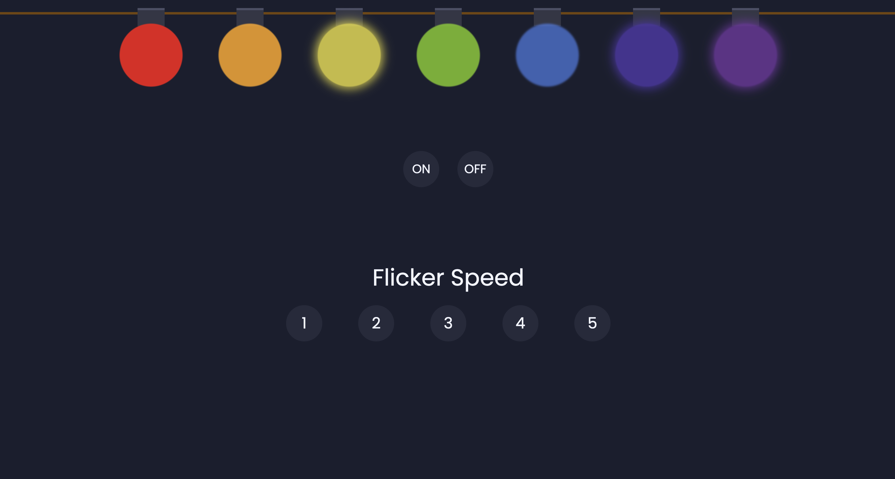

# 🎄 Christmas Lights

A simple interactive web project that simulates a colorful strand of rippling Christmas lights. Users can turn the lights on/off and adjust the flicker speed. Built with **HTML**, **CSS**, and **JavaScript**.

---

## 🌐 Tech Stack
- **HTML** – Structure of the bulbs, rope, and UI controls  
- **CSS** – Animations, colors, layout, and styling  
- **JavaScript** – Handles flicker logic, speed controls, and power toggle  

---

## ✨ Features
- Animated Christmas lightrope with seven bulbs  
- ON/OFF power button  
- Five flicker-speed levels  
- Smooth CSS-driven animation  
- Lightweight, fast, and runs in any browser  

---

## Screenshot



## 🚀 Getting Started

### 1. Clone the repository
```bash
git clone https://github.com/your-username/Christmas-Lights.git
cd Christmas-Lights
```
